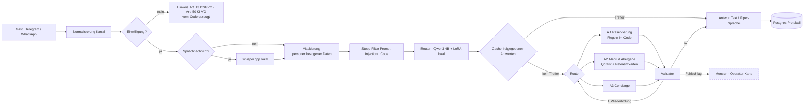

# Architektur / Architecture

| Workflow | Aufgabe / Purpose | Trigger |
|---|---|---|
| `P15_MAIN_Basilik` | Dialog, Routing, Agenten, Validator, Eskalation / dialogue, routing, agents | Telegram, WhatsApp |
| `P15_W2_Reminders` | Erinnerung T−2 h, Schweigen → Team informieren / reminder 2 h before | Zeitplan |
| `P15_W3_Metrics` | Kennzahlen je Stunde, Dienste-Check / hourly metrics | Zeitplan |
| `P15_W4_Eval` | nächtliche Bewertung durch Modell eines anderen Herstellers / nightly LLM-as-a-judge | Zeitplan 03:00 |
| `P15_W5_Ingestion` | Postgres → bge-m3 → Qdrant | manuell |
| `P15_W6_Booking-Summary` | Tagesübersicht der Reservierungen / daily booking summary | Zeitplan 09:00 |
| `P15_W7_Watchdog` | Überwachung der lokalen Dienste / local stack watchdog | Zeitplan, Error |

Datenbank / database: `db/01_schema.sql` (Tabellen, Beispiel-Speisekarte, Regeln) und `db/02_answer_cache.sql` (Cache mit Fingerabdruck der Wissensbasis). Kommentare im SQL auf Russisch.
